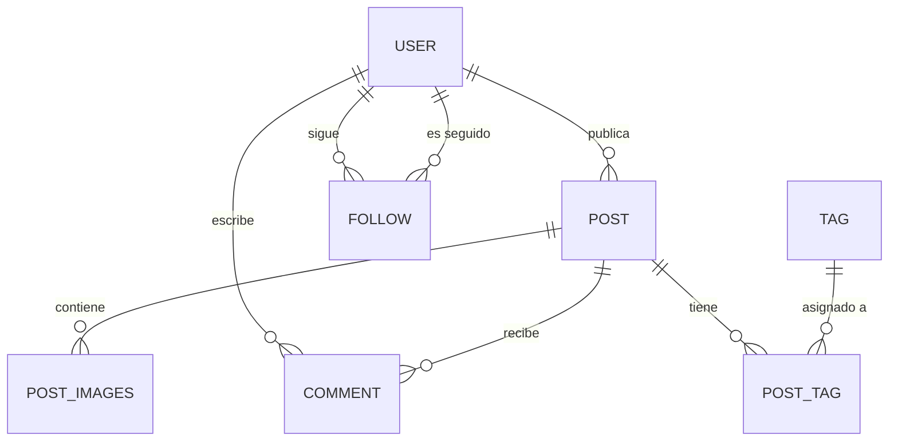

[](https://classroom.github.com/a/I9P6ejM-)


# 🚀 UnaHur Anti-Social Net

Backend de una red social, hecha con Node.js + Express + Sequelize. Sigue el patrón **Controller → Service → Repository** para mantener las capas bien separadas y que el código sea más mantenible.


## 📋 Descripción

Esto es el **MVP** de la **"UnaHur Anti-Social Net"**, una red social inspirada en las plataformas populares.
La idea es que la gente pueda:

-   Crear posts con descripción y opcionalmente mandar imágenes.
-   Comentar los posts de otros.
-   Etiquetar posts con tags.
-   Seguirse entre usuarios.

## 🏗️ Arquitectura

```
src/
├── config/         → Configuración de Sequelize 
├── controllers/    → La capa que recibe los requests y llama a los services
├── helpers/        → Utils: manejo de errores y respuestas estandarizadas
├── middlewares/    → Error handler, validator, catchAsync
├── models/         → Modelos de Sequelize (User, Post, Comment, Tag, etc.)
├── repositories/   → Capa de acceso a datos 
├── routes/         → Definición de endpoints con Swagger docs
├── schemas/        → Validación con Joi
├── service/        → Lógica de negocio
├── main.js         → Entry point del server
└── swagger.js      → Configuración de Swagger
```

## 🧠 Entidades

| Entidad       | Descripción |
|---------------|-------------|
| **User**      | Usuarios registrados. `nickName` es la clave primaria. |
| **Post**      | Publicaciones con descripción obligatoria y fecha. |
| **Post_Images** | Imágenes asociadas a un post. |
| **Comment**   | Comentarios en posts. Tienen un `visible` que depende de la config de meses. |
| **Tag**       | Etiquetas reutilizables. |
| **Follow**    | Seguimiento entre usuarios. |

### Diagrama Entidad-Relación




## 🚀 Cómo levantar esto

```bash
# 1. Clonás el repo
git clone <repo-url>
cd anti-social-relational-tp-i-use-arch-btw

# 2. Instalás las dependencias
pnpm install

# 3. Configurás las variables de entorno (copiás el .env.example)
cp .env.example .env

# 4. Corrés las migraciones (crea las tablas)
pnpm dlx sequelize-cli db:migrate

# 5. (Opcional) Sembrás data de prueba
pnpm dlx sequelize-cli db:seed:all

# 6. Lo prendés
pnpm run dev
```

El server arranca en `http://localhost:3000` y la docu de Swagger en `http://localhost:3000/api-docs`.

## 🌍 Variables de Entorno

| Variable                      | Default | Descripción |
|-------------------------------|---------|-------------|
| `PORT`                        | `3000`  | Puerto del server |
| `NODE_ENV`                    | `development` | Entorno |
| `DB_STORAGE`                  | `./data/data.sqlite` | Ruta de la DB (SQLite) |
| `COMMENT_VISIBILITY_MONTHS`   | `6`     | Meses de visibilidad de comentarios |

## 📬 Endpoints

### Users
- `GET /api/users` — Lista todos los usuarios
- `GET /api/users/:nickName` — Busca un user por nick
- `POST /api/users` — Crea un usuario
- `PUT /api/users/:nickName` — Actualiza un usuario
- `DELETE /api/users/:nickName` — Borra un usuario

### Posts
- `GET /api/posts` — Lista todos los posts
- `GET /api/posts/:id` — Busca un post por ID
- `POST /api/posts` — Crea un post
- `PUT /api/posts/:id` — Actualiza un post
- `DELETE /api/posts/:id` — Borra un post

### Comments
- `GET /api/comments` — Lista comentarios
- `POST /api/comments` — Crea un comentario
- `PUT /api/comments/:id` — Actualiza un comentario
- `DELETE /api/comments/:id` — Borra un comentario

### Tags
- `GET /api/tags` — Lista tags
- `POST /api/tags` — Crea un tag
- `DELETE /api/tags/:id` — Borra un tag

### Follow
- `POST /api/follow/:followerNick/:followingNick` — Seguir a alguien
- `DELETE /api/follow/:followerNick/:followingNick` — Dejar de seguir

> Para más detalle, cuando el server esté corriendo entra a `/api-docs`.

## 🧪 Testing

En la raíz del proyecto está el archivo `ANTI-SOCIAL-NET.postman_collection.json` con todos los endpoints para importar en Postman y probar todo.
